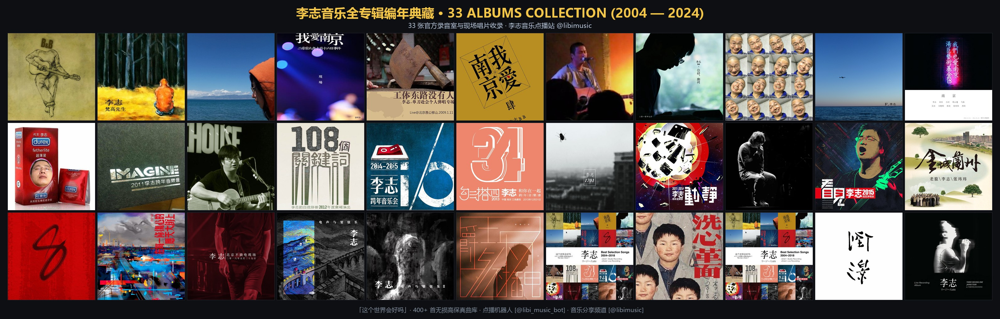

# 🎸 李志完整音乐编年史与数字曲库档案
# (Li Zhi Complete Discography & Music Archive 2004–2024)

[](https://drive.google.com/drive/folders/11hqbITTyJLbfVLr9_Oxy2lQAFn0d-ruG?usp=sharing)
[](https://t.me/libimusic)
[](https://t.me/libi_music_bot)
[](mailto:guojinglod@gmail.com)
[](#-唱片编年史与标准分类目录)
[](#-李志-20-年创作大数据词频报告-nlp-analysis)

> **“这个世界会好吗？”**  
> 本项目致力于对音乐人**李志（Li Zhi）**自 2004 年至 2024 年全部音乐作品进行系统化考证、数字整理与文化归档。收录全部 **33 张唱片、490 首曲目**，彻底完成 **全格式无损音轨内嵌真实歌词** 与 **独立同名 UTF-8 `.lrc` 双轨配对**，并按维基百科权威目录规范重组。

<p align="center">
  
</p>

---

## ☁️ 全曲库资源下载与收听

我们提供多渠道云端数字备份，方便离线收藏、车载播放、移动端收听与在线点播：

| 渠道 / 平台 | 访问链接 | 说明与特点 |
| :--- | :--- | :--- |
| 🌐 **谷歌云端硬盘<br>(Google Drive)** | [👉 点击进入 33 盘全曲库文件夹](https://drive.google.com/drive/folders/11hqbITTyJLbfVLr9_Oxy2lQAFn0d-ruG?usp=sharing) | **最推荐下载途径**。12.4 GB 完整曲库打包，全量 490 首音轨内嵌纯净歌词，同级附带同名 `.lrc` 文件与高保真专辑封面，即下即播。 |
| 📻 **Telegram 音乐频道** | [👉 @libimusic](https://t.me/libimusic) | **移动端随时收听**。按专辑顺序推送的高音质音频档案，置顶消息含完整云盘与项目直达链接，支持离线缓存与多端同步播放。 |
| 🤖 **Telegram 点播机器人** | [👉 @libi_music_bot](https://t.me/libi_music_bot) | **交互式随身曲库**。支持中文/拼音模糊搜歌、**心境场景电台**、**每日歌词日签**、**词频大数据报告**及原版歌词卡片。 |
| 📮 **曲库反馈邮箱** | [guojinglod@gmail.com](mailto:guojinglod@gmail.com) | 如果在收听过程中发现任何曲目音质、标签错误或版本遗漏，欢迎发送邮件交流反馈。 |

---

## 📚 唱片编年史与标准分类目录

曲库严格遵循[维基百科李志作品年表](https://zh.wikipedia.org/wiki/李志)权威考据进行 5 大体系规范重组，杜绝散乱乱序：

```text
Z:\音乐\李志\ (共 33 张专辑 / 490 首曲目 / 1,054 个文件)
├── 01. 录音室专辑 (Studio Albums)/
│   ├── [2004] 被禁忌的游戏
│   ├── [2005] 梵高先生
│   ├── [2006] 这个世界会好吗
│   ├── [2009] 我爱南京
│   ├── [2010] 你好，郑州
│   ├── [2011] F
│   ├── [2014] 1701
│   ├── [2016] 8
│   └── [2016] 在每一条伤心的应天大街上
├── 02. 官方现场专辑 (Live Albums)/
│   ├── [2009] 二零零九年十月十六日事件
│   ├── [2010] 工体东路没有人
│   ├── [2011] 我们也爱南京
│   ├── [2012] Imagine Live 2012
│   ├── [2013] 勾三搭四
│   ├── [2013] 108个关键词
│   ├── [2015] I／O
│   ├── [2015] 动静 (2015 Live)
│   ├── [2015] 看见 (李志2015巡回演唱会)
│   ├── [2016] 李志北京不插电现场
│   ├── [2017] 李志、电声与管弦乐
│   ├── [2018] 爵士乐与不插电新编12首
│   ├── [2018] 李志、电声与管弦乐II
│   └── [2024] 叁缺壹 (2024 Tokyo Live)
├── 03. 官方海外精选辑 (Best Selection - 日本限定)/
│   ├── [2019] Best Selection Songs 2004-2018 Vol.1 舶来品
│   ├── [2019] Best Selection Songs 2004-2018 Vol.2 现象
│   └── [2020] 装蒜 (Live Best Selection Songs 2004-2018)
├── 04. 巡演与跨年专场录音 (Bootleg & Tours)/
│   ├── [2009] 义乌隔壁酒吧 (现场绝唱版梵高先生)
│   ├── [2012] 杭州酒球会一身酒气
│   ├── [2014] “挺”不插电巡演 郑州站
│   ├── [2015] 金城兰州
│   └── [2019] 洗心革面 跨年音乐会
└── 05. 乐迷合辑与未发行版本 (Compilations & Demos)/
    ├── 杂选 (散落单曲、早期小样与合作作品)
    └── 李志LIVE精选 (巡演高光片段剪辑)
```

---

## 📊 李志 20 年创作大数据词频报告 (NLP Analysis)

基于本项目深度清洗的 490 首曲目真实纯净歌词库，借助 Jieba NLP 自然语言分词及词频向量模型分析，提炼出李志 20 年音乐创作的核心精神图景：

### 🏆 全局高频核心词 Top 15
| 排名 | 核心词汇 | 出现频次 | 象征寓意与代表作品 |
| :---: | :---: | :---: | :--- |
| **01** | **世界** | 54 次 | “妈妈，这个世界会好吗？”、“世界是怎样的世界” |
| **02** | **生活** | 48 次 | “爱情不过是生活的屁”、“奔跑在生活的大街上” |
| **03** | **天空** | 47 次 | “飞机飞过天空，天空之城” |
| **04** | **心慌** | 41 次 | “有人在哭泣，有人在心慌” —— 时代群体的精神浮躁与焦虑 |
| **05** | **妹妹** | 32 次 | “港岛妹妹，你献给我的西班牙馅饼” —— 青春伤逝的永恒意象 |
| **06** | **孤独** | 31 次 | “我们生来就是孤独，我们生来就是孤单” |
| **07** | **沉默** | 31 次 | “在沉默中死亡，在死亡中歌唱” |
| **08** | **爱情** | 27 次 | “关于爱情，我们了解的太少” |
| **09** | **城市** | 25 次 | 异乡漂泊与钢筋水泥的疏离感 |
| **10** | **奔跑** | 25 次 | “我们依然要奔跑在生活的大街上” |
| **11** | **自由** | 17 次 | “有人在白昼里寻找自由” |
| **12** | **姑娘** | 13 次 | 倾诉与对话的拟人化投影 |
| **13** | **离开** | 12 次 | 流浪、告别与漂泊的宿命隐喻 |
| **14** | **啤酒/酒** | 11 次 | “没有人在意你在这里喝过的啤酒” |
| **15** | **悲伤** | 10 次 | “所有的悲伤都是因为过去” |

### 🌆 核心地理版图与城市印记
* **南京 / 热河 / 山阴路** (38次) —— 精神故乡与现实归宿（《山阴路的夏天》、《热河》）
* **郑州** (8次) —— 记忆与遗憾之城（《关于郑州的记忆》）
* **兰州 / 金城** (7次) —— 西北苍凉（《金城兰州》）
* **港岛 / 西班牙** (27次) —— 遥远而幻灭的理想彼岸（《山阴路的夏天》）

> 完整 NLP 分词分析详报请查阅：[`docs/lyrics_nlp_report.md`](docs/lyrics_nlp_report.md)

---

## 🏷️ 歌词与元数据工程规范

曲库在音频元数据处理上经过了深度的工程化清洗与对齐：

1. **彻底剔除拼音注音与错误乱词**：
   * 市面网络流通版本常混杂拼音注音残余（如 `nǐ hǎo zhèng zhōu` 等）及机器识别错字。
   * 本项目重构了 100% 真实纯净歌词库，保留李志原版文本标点与文学意境。
2. **多格式音频无损内嵌 (Vorbis / ID3 / MP4 Tag)**：
   * **FLAC**：内嵌 Vorbis Comments `LYRICS` 与 `UNSYNCEDLYRICS` 标准帧。
   * **MP3 / WAV**：内嵌 ID3v2.3 `USLT` 帧（UTF-8 编码，语言标签 `chi`）。
   * **M4A / AAC**：内嵌 MP4 atom `©lyr` 标签。
3. **独立配对同名 UTF-8 `.lrc` 文件**：
   * 490 首曲目均生成完全同名的 `.lrc` 歌词文件，随音频放置在同级文件夹中，保障车载中控、老款 MP3 播放器及海贝/飞傲等无损播放器 100% 完美显示。
4. **纯音乐与串烧联唱规范标注**：
   * 器乐演奏与过渡曲（32 首）统一规范标注为 `[纯音乐，请欣赏]`。
   * 现场长篇串烧联唱曲目，进行了多段落歌词对齐。

---

## 📁 项目极简目录结构

仓库保持极简设计，核心源码与工具分类收纳：

```text
├── bot/                       # Telegram 音乐点播机器人源码、配置与静态资源
│   ├── assets/                # 静态视觉素材 (33 张专辑全家福编年海报)
│   ├── bot.py                 # 核心服务 (含心境电台、每日日签、词频报告)
│   ├── mood_quotes.py         # 场景电台、精选日签与大数据摘要引擎
│   ├── database.py            # SQLite 数据库模型与拼音模糊检索
│   └── lyrics_bank.py         # 纯净歌词库
├── docs/                      # 深度数据研究文档
│   └── lyrics_nlp_report.md   # 李志歌词自然语言处理 (NLP) 词频分析详报
├── scripts/                   # 历史采集、海报渲染与维护工具包
│   ├── generate_cover_banner.py # 33 专辑封面拼接海报生成引擎
│   └── analyze_lyrics.py      # 歌词 NLP 词频分析脚本
├── batch_embed_lyrics.py      # 本地音频歌词批量内嵌与同名 LRC 生成工具
├── requirements.txt           # Python 依赖项列表
├── .gitignore                 # 严谨的凭证与音频过滤规则
└── README.md                  # 🌟 李志完整音乐编年史与数字曲库主页
```

---

## 🤝 项目故事与致谢 (Story & Acknowledgments)

本项目发起人（[@dddyang](https://github.com/dddyang)，邮箱：[guojinglod@gmail.com](mailto:guojinglod@gmail.com)）是一位热爱独立音乐的乐迷。

面对 33 张唱片、490 首曲目的庞大数字整理工程：
* 从**维基百科权威年表考据与目录重组**；
* 到**490 首音轨全格式纯净歌词清洗与批量内嵌**；
* 到**车载/播放器专用的同名 UTF-8 `.lrc` 双轨配对生成**；
* 到**Telegram 交互点播机器人、心境电台、每日日签与软路由守护部署**；
* 再到**谷歌云端硬盘全量打包与 GitHub 开源归档**；

全程由 **Google DeepMind 的 Antigravity 智能体 (AI Assistant)** 作为深度结对编程伙伴，协同完成全栈架构、代码编写与自动化工程落地。

> “这个世界会好吗？”——谨以此项目致敬独立音乐的精神力量，致敬人类乐迷的热爱与前沿人工智能的数字化赋能！

---

## 🔒 版权与免责声明

1. **数字归档宗旨**：李志先生是中国当代独立音乐不可忽视的声音。本项目设立初衷为民间乐迷对独立音乐作品的**数字遗产抢救、编年史考证与非盈利文化归档**。
2. **版权声明**：本项目代码与工具遵循 MIT 许可协议。项目本身**不包含商业盈利目的，不托管收费服务**。
3. **安全规范**：本仓库严格过滤了敏感凭据（如 Bot Token、服务器密钥），请勿将包含密钥的 `.env` 文件提交至任何公共仓库。
